# АИС "Веб-форум"

Веб-форум на чистом PHP, являющийся шаблоном для заполнения на любую тематику.

# 1. Развёртывание

## 1.1. Необходимые компоненты

- GIT;
- Docker, Docker-Compose.

## 1.2. Порядок развёртывания

1. Склонировать репозиторий:

   ```bash
   git clone https://github.com/Nikolai2038/nikolai-forum
   ```

2. Перейти в папку с проектом и скопировать файл `.env` в файл `.env`:

   ```bash
   cd nikolai-forum
   cp .env.example .env
   ```
3. Настроить файл `.env` на своё усмотрение.

4. Также, скопировать файл `php-apache/public/includes/mysql/mysql_connect.php.example` в файл `php-apache/public/includes/mysql/mysql_connect.php`:

   ```bash
   cp php-apache/public/includes/mysql/mysql_connect.php.example php-apache/public/includes/mysql/mysql_connect.php
   ```
5. Настроить файл `php-apache/public/includes/mysql/mysql_connect.php` на своё усмотрение.

6. Запустить проект командой:

   ```bash
   docker-compose up -d
   ```

7. Проверить работу системы в браузере по адресу `http://localhost:80/`.
   Порт настраивается в `.env`, `80` - значение по умолчанию.
   Для входа в систему под учётной записью главного администратора, использовать логин `admin` и пароль `123456789`.
8. После завершения работы с системой остановить проект командой:

   ```bash
   docker-compose down
   ```

# 2. Описание системы

## 2.1. Функциональные возможности системы

АИС "Веб-форум" обеспечивает выполнение следующих функций:

- Регистрацию и авторизацию пользователей;
- Просмотр и фильтрацию списка зарегистрированных пользователей;
- Просмотр профиля каждого пользователя, возможность изменить информацию;
- Создание, изменение и удаление групп;
- Изменение привязки пользователей к группам; просмотр списка групп каждого пользователя;
- Возможность просмотра, выдачи и снятия предупреждений и банов;
- Возможность просматривать, создавать, изменять и удалять форумы, темы и комментарии к темам;

## 2.2. Достоинства АИС "Веб-форум"

- Система предоставляет возможность заполнения веб-форума на абсолютно любую тематику;
- АИС является полноценным сайтом с регистрацией и авторизацией пользователей;
- Шифрование паролей пользователей в БД через MD5;
- Сайт защищён от SQL-инъекций;
- При авторизации пользователя, его данные хранятся в сессии, а не в cookies.

## 2.3. Обзор средств разработки

Для разработки сайта использовались технологии: HTML, CSS, PHP, SQL и немного JavaScript.

## 2.4. ER-диаграмма

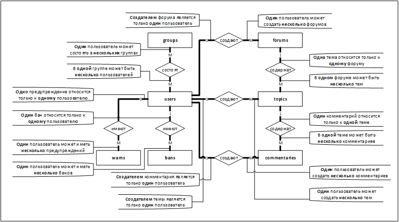

ER-диаграмма описывает 7 сущностей:

- `users` – пользователи;
- `groups` – группы;
- `warn` – предупреждения;
- `bans` – баны;
- `forums` – форумы;
- `topics` – темы;
- `commentaries` – комментарии.

Пользователи принадлежат к группам, и могут иметь предупреждения и баны.

Форумы содержат темы, а темы – комментарии.

## 2.5. Схема базы данных

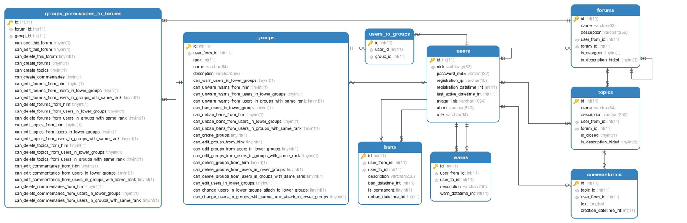

База данных имеет 9 таблиц:

- `users` – пользователи;
- `groups` – группы;
- `users_to_groups` – принадлежность пользователей к группам;
- `warn` – предупреждения;
- `bans` – баны;
- `forums` – форумы;
- `groups_permissions_to_forums` – права групп для форумов;
- `topics` – темы;
- `commentaries` – комментарии.

## 2.6. Структура сайта

Сам веб-форум не является только форумом, он представляет из себя целый сайт, который имеет несколько основных страниц:

- `Главная`
- `Форум`
- `Личный кабинет`
- `Пользователи`.

Первая страница – `Главная`, на ней есть только текст с приветствием, но впоследствии, если сайт будет использоваться, есть возможность разместить на этой странице общую информацию о сайте.

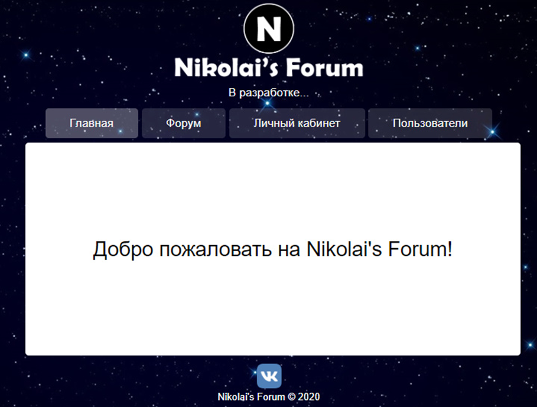

## 2.7. Регистрация / Авторизация

- Следующая страница – `Личный кабинет`.
- При попытке перехода на эту страницу проверяется, вошёл ли пользователь в аккаунт.
- Если нет – его перекидывает на страницу авторизации.
- Со страницы авторизации можно перейти на страницу регистрации, нажав на ссылку `Регистрация` снизу формы, после чего будет совершён переход на страницу регистрации.
- При регистрации, необходимо указать уникальный ник и придумать пароль.
- Информация о зарегистрированных пользователях хранится в таблице users.
- Для ника можно использовать только латинские буквы, цифры и символы `-` и `_`, длина: 5-32 символа;
- Для пароля также можно использовать другие спец. символы. Длина пароля: 8-32 символа;

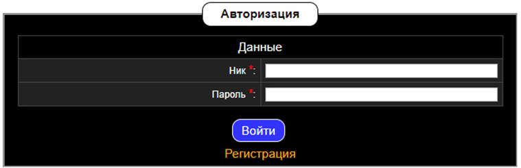

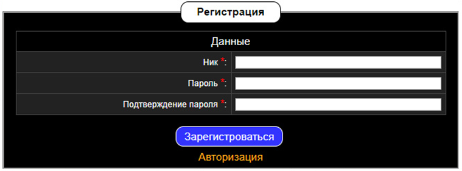

## 2.8. Список пользователей

- Страница `Пользователи` позволяет посмотреть список всех зарегистрированных пользователей.
- В таблице отображается ID пользователя, его ник, дата регистрации и статус (онлайн / оффлайн / забанен).
- На одной странице отображается 30 пользователей, навигация по страницам производится при помощи формы снизу страницы.

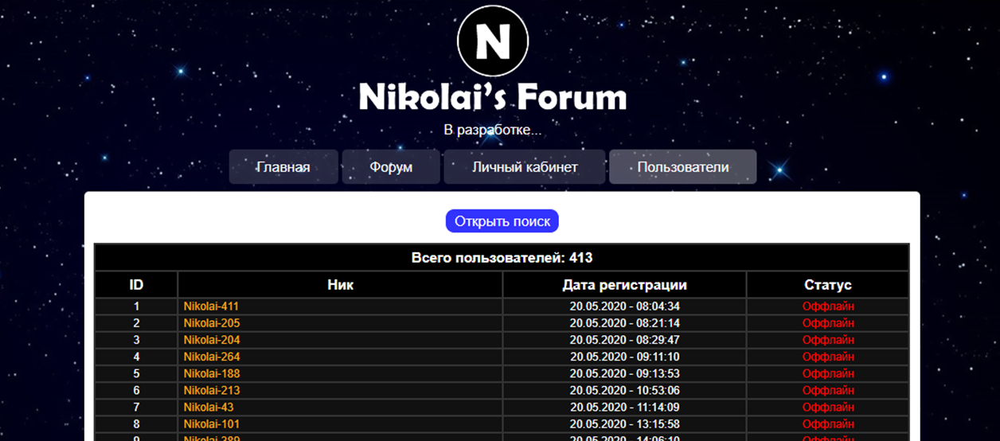


## 2.9. Фильтрация пользователей

- На странице просмотра пользователей также доступна возможность фильтрации пользователей по имени и группам, в которых состоят пользователи.
- Например, на текущем скриншоте, показана фильтрация пользователей, которые состоят в группе `Владельцы`.

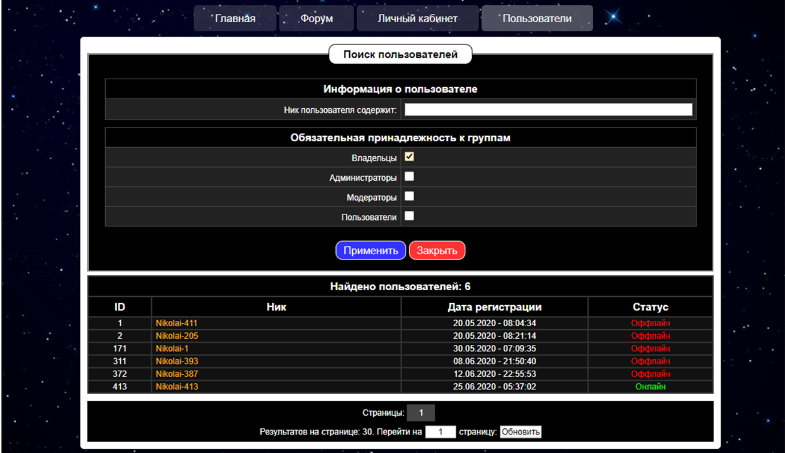

## 2.10. Профиль пользователя

- После авторизации, пользователь попадает в свой профиль.
- Зайти можно в профиль любого пользователя, нажав на его ник на странице `Пользователи`.
- В профиле отображается информация о пользователе: его аватарка, дата регистрации, дата последней активности на сайте, информация `о себе`.
- Также выводится статистика пользователя: количество групп, в которых он состоит, количество созданных тем и комментариев, количество полученных предупреждений и банов.

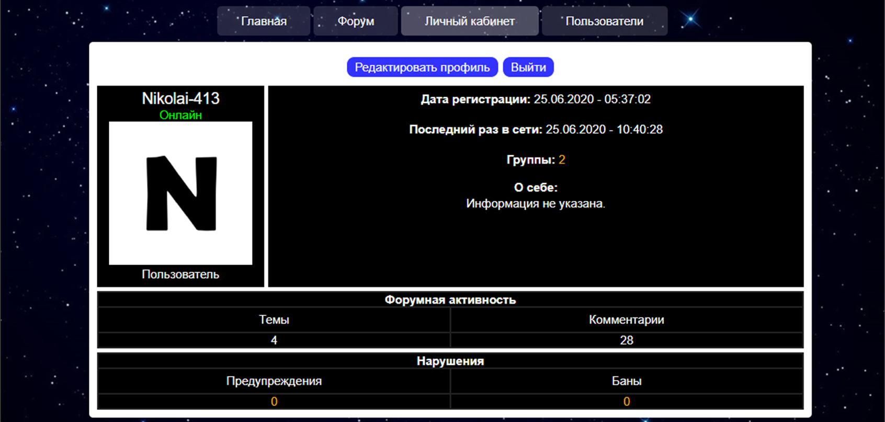

## 2.11. Группы пользователей

- Информация о группах хранится в таблице `groups`.
- Изначально, на веб-форуме должны присутствовать группы: `Владельцы` (полные права), `Пользователи` (без прав) и `Гости` (без прав).
- В группу `Пользователи` попадают все зарегистрированные посетители сайта.
- Группа `Гости` будет присваиваться тем посетителям сайта, которые не вошли в аккаунт.

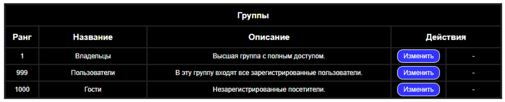

- Права групп делятся на общие (предупреждения, баны и др.) и форумные права – права группы к конкретному форуму (изменение, удаление, создание других форумов, тем и др.);
- Пользователь может создавать и изменять группы и их права, если сам имеет на это соответствующее право.

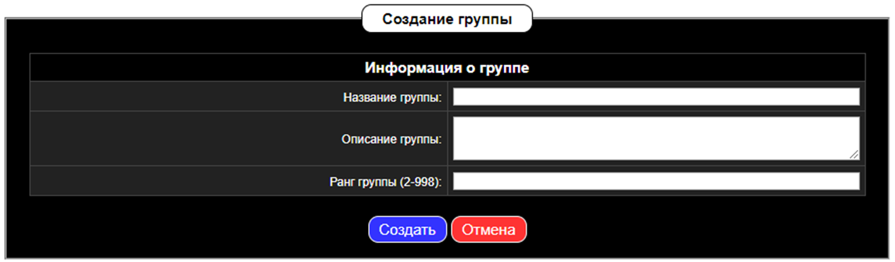

## 2.12. Изменение прав групп

Существуют установки, которые нельзя обойти, даже имея права `владельца`:

- Для группы `Владельцы` все общие права разрешены;
- Для групп `Пользователи` и `Гости` все общие права запрещены.

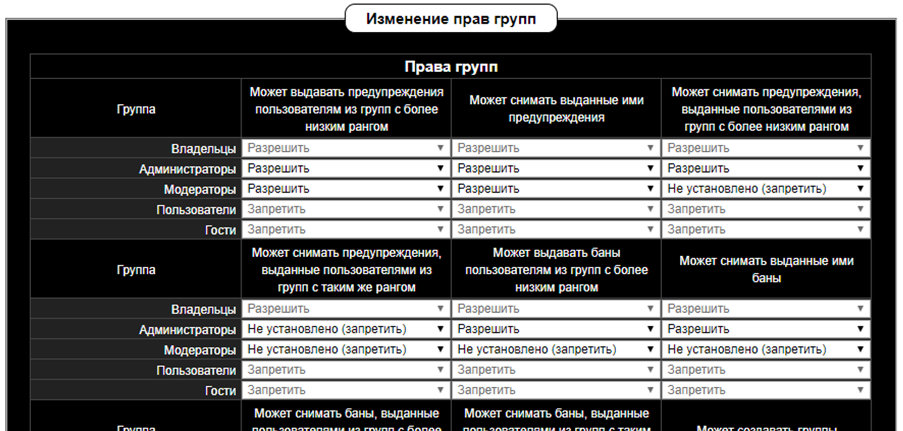

## 2.13. Привязанность к группам

- Права пользователя определяются группами, в которых он состоит;
- Пользователь может поменять привязанность другого пользователя к группам, если имеет на это соответствующее право.
- Данные о привязанности пользователей к группам хранятся в таблице `users_to_groups`.

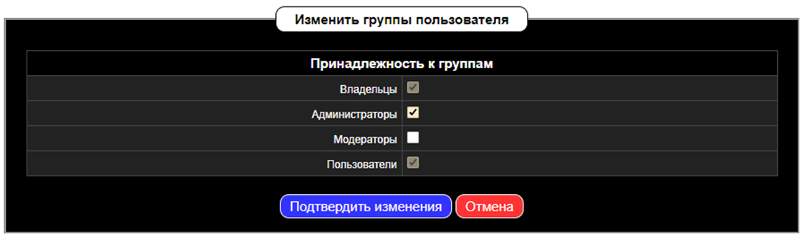

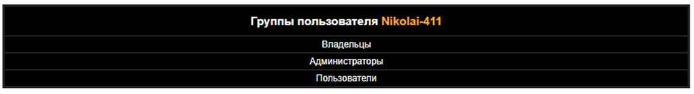

## 2.14. Предупреждения

- Предупреждения являются сообщениями, которые получает пользователь, и не влекут никакой блокировки.
- Опять же, выдать предупреждение может только тот пользователь, который имеет на это право.
- Предупреждения хранятся в таблице `warns`.

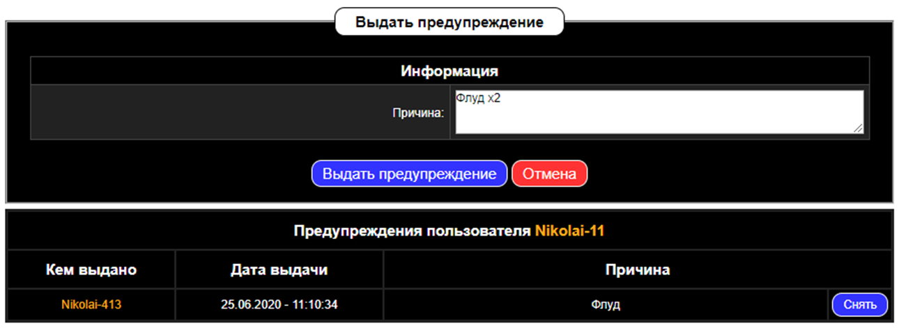

## 2.15. Баны

- Баны, в отличии от предупреждений, не позволят пользователю зайти в аккаунт до тех пор, пока бан не спадёт.
- Бан может быть выдан на время или же навсегда.
- Если забаненный пользователь сейчас на сайте – его выкинет из аккаунта и он не сможет войти обратно.
- Баны хранятся в таблице `bans`.

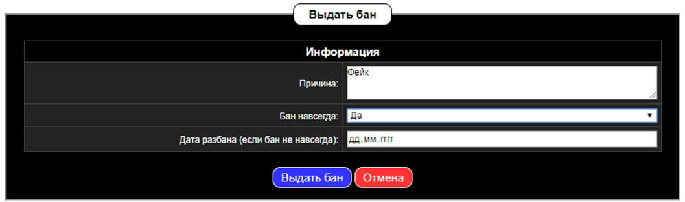

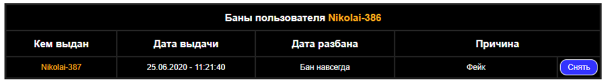

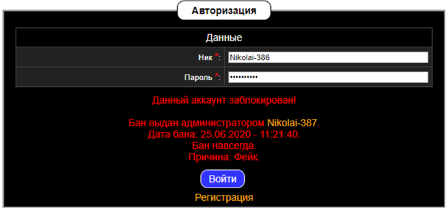

## 2.16. Снятие предупреждений и банов

- И баны, и предупреждения можно снять при наличии соответствующих прав у пользователя.

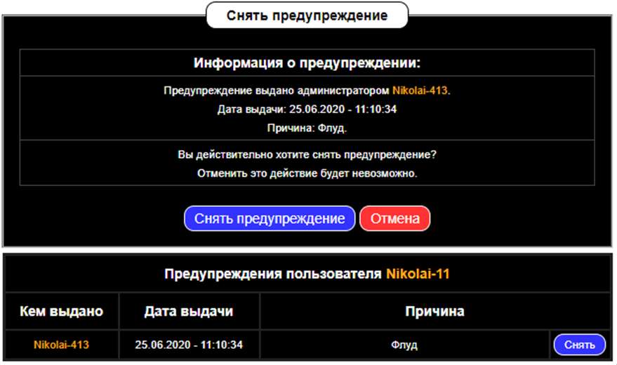

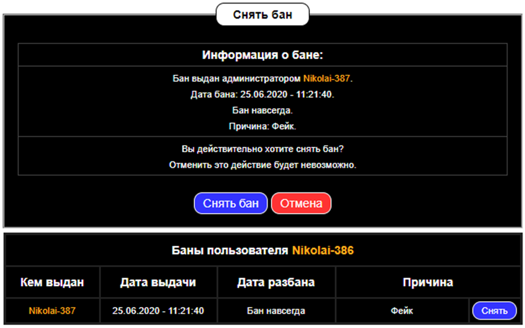

## 2.17. Форумы

- Информация о форумах хранится в таблице `forums`.
- Страница каждого форума имеет одинаковую структуру: сверху страницы будут расположены кнопки для: изменения этого форума, удаления этого форума, создания нового форума и создания новой темы (если пользователь имеет соответствующие права).
- Чуть ниже расположено окно навигации.
  Оно показывает вложенность текущего форума, то есть выводит названия и ссылки на все форумы для попадания в текущий форум.
  Таким образом, самым первым в списке всегда будет идти главный форум.
  Главный форум существует изначально (его ID = 0) и его нельзя удалить.
- Далее выводится таблица, которая отображает все форумы и темы в данном форуме, а также небольшую статистику по ним: количество тем в каждом форуме, общее количество сообщений в форуме / теме, а также информацию о последнем оставленном сообщении в форуме / теме.
  В самом низу страницы выводится информирующая таблица по иконкам.

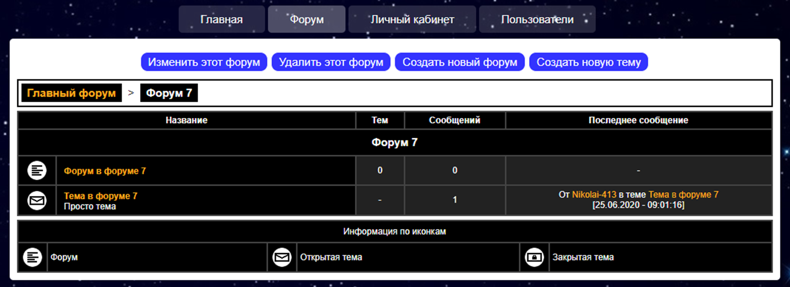

- При создании форума необходимо ввести название форума, его описание (необязательно), выбрать, скрывать ли описание, выбрать, является ли форум категорией и выбрать расположение форума.
  Ниже необходимо настроить форумные права для групп.
- При этом опять же, пользователь, который будет менять права форума, не сможет выставить права для групп, которые выше его по рангу – значения привилегий этих групп будут установлены в 2 (наследование).
  Для группы `Владельцы` все права всегда будут разрешены, а для группы `Гости` все права, кроме `Может видеть этот форум` (эту привилегию можно менять) будут запрещены.
- Прежде, чем удалить форум, необходимо удалить или переместить все форумы и темы в нём.
  Если этого не сделать, то попытка удаления выдаст ошибку.
- Права для форумов хранятся в таблице groups_permissions_to_forums.
  Для каждой группы к каждому форуму существует запись в этой таблице, определяющая права этой группы.
  Записи в эту таблицу добавляются автоматически.

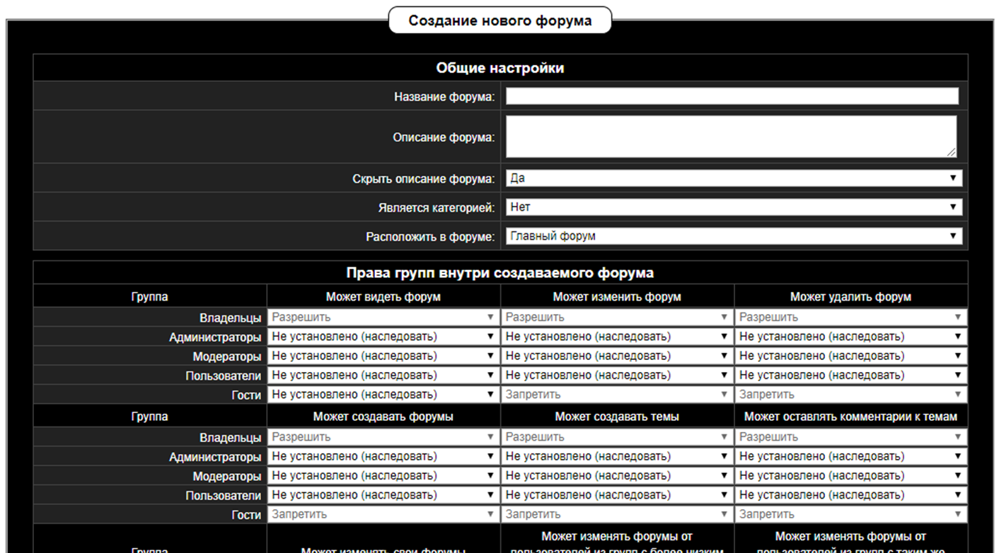

- Прежде, чем удалить форум, необходимо удалить или переместить все форумы и темы в нём.
  Если этого не сделать, то попытка удаления выдаст ошибку.
- Отличие форума от категории состоит лишь в отображении.
  Если форум не является категорией, то при выводе его строчки, его дочерние форумы отображаться не будут.
  Если же форум является категорией, то вывод его строчки приобретает особенный вид, а дочерние форумы будут видны его родителю.

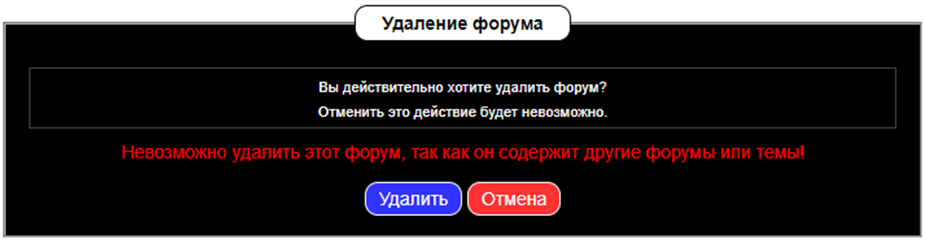

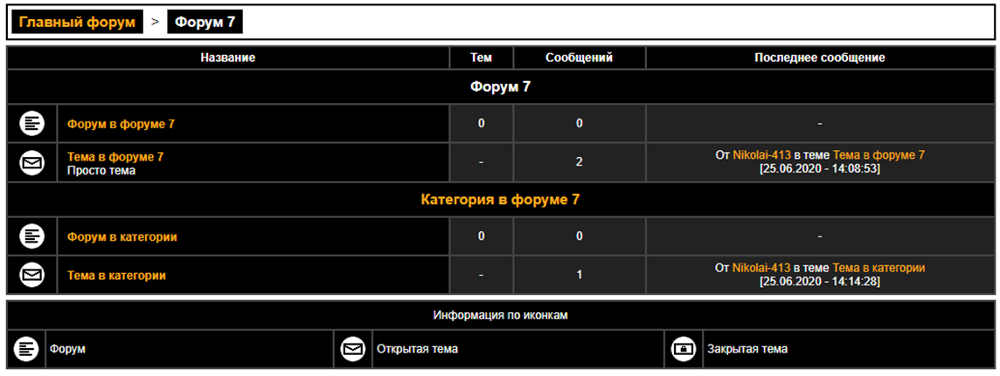

## 2.18. Темы

- Информация о темах хранится в таблице `topics`.
- Окно создания или изменения темы включает в себя ввод: названия темы, описания темы, выбор, скрывать ли описание темы, статус темы (закрыта / открыта), расположение и текст темы.
  После создания темы, пользователя автоматически перекидывает в созданную тему.
- Для добавления комментария существует форма снизу страницы темы.
  На странице темы также есть две формы навигации по страницам – сверху и снизу страницы.
  Комментариев на странице – 10 штук.
  При переполнении этого количества, появляются ссылки на другие страницы.
  Также, когда пользователь отправляет комментарий, его перекидывает в конец темы, к созданному комментарию.

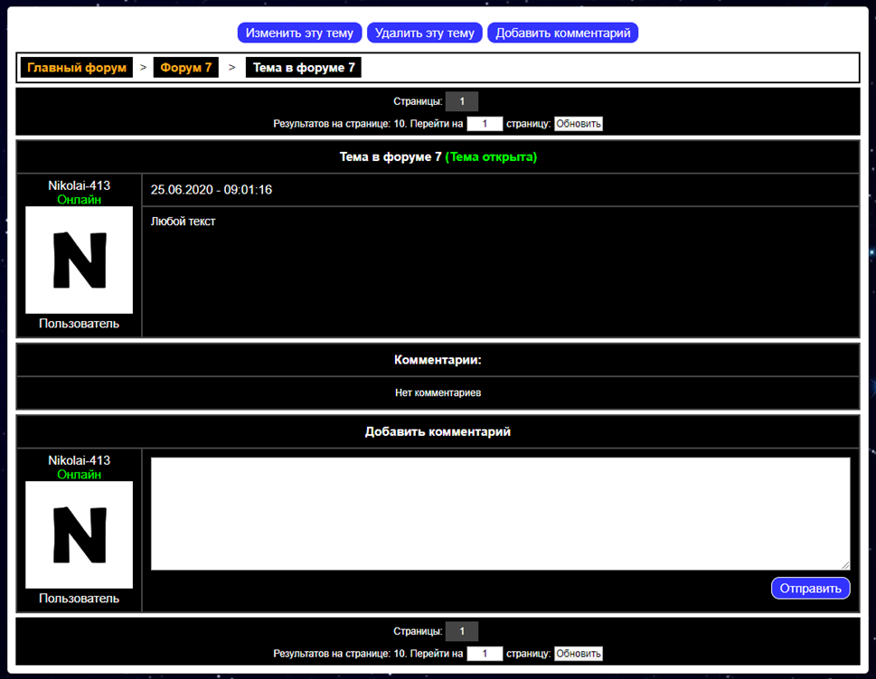

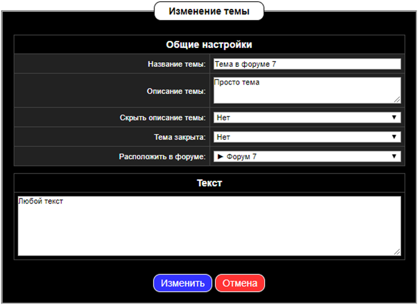

## 2.19. Комментарии

- Информация о комментариях хранится в таблице `commentaries`.
- При изменении комментария, комментарий заменяется на форму редактирования.
  Аналогично, при удалении комментария, подтверждение действия производится под комментарием.

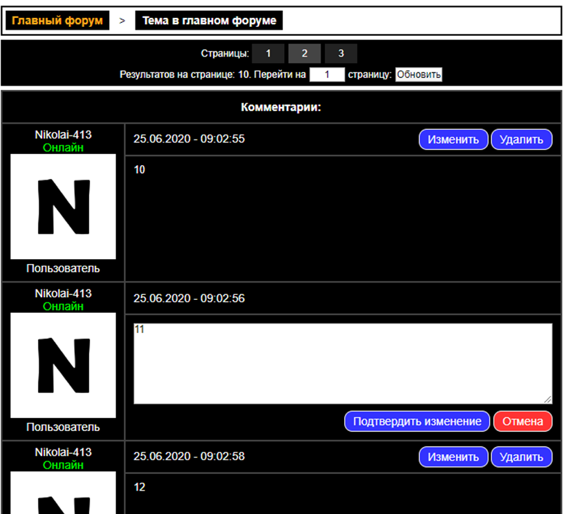

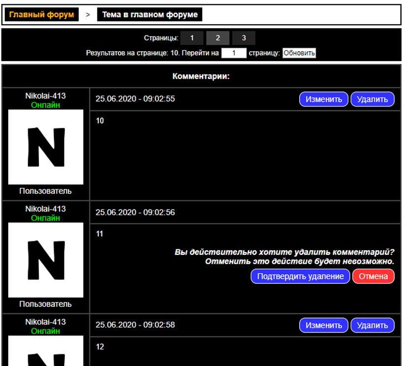
